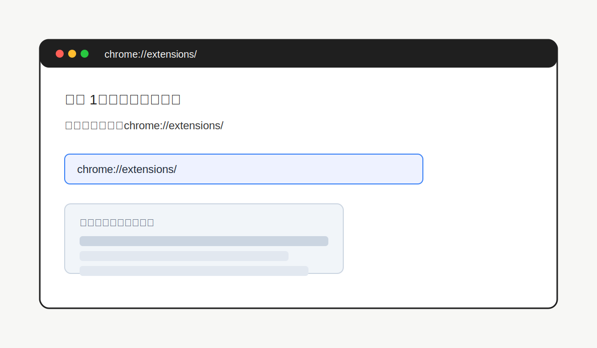
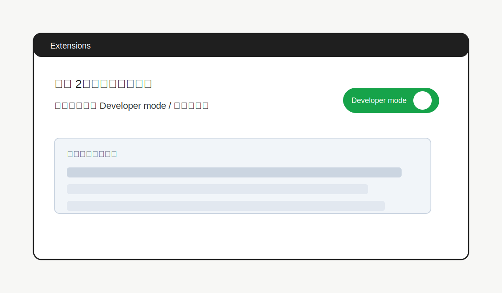
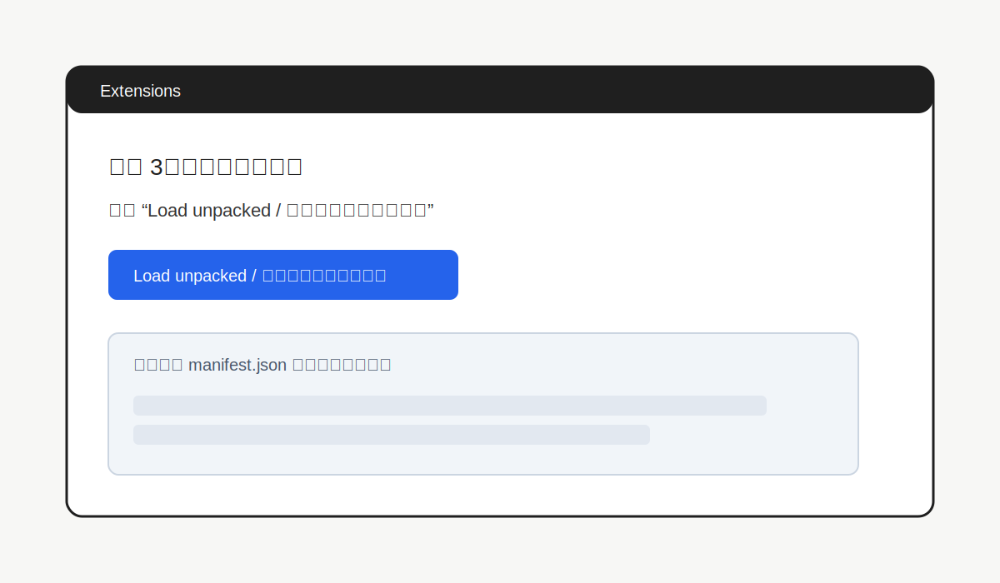
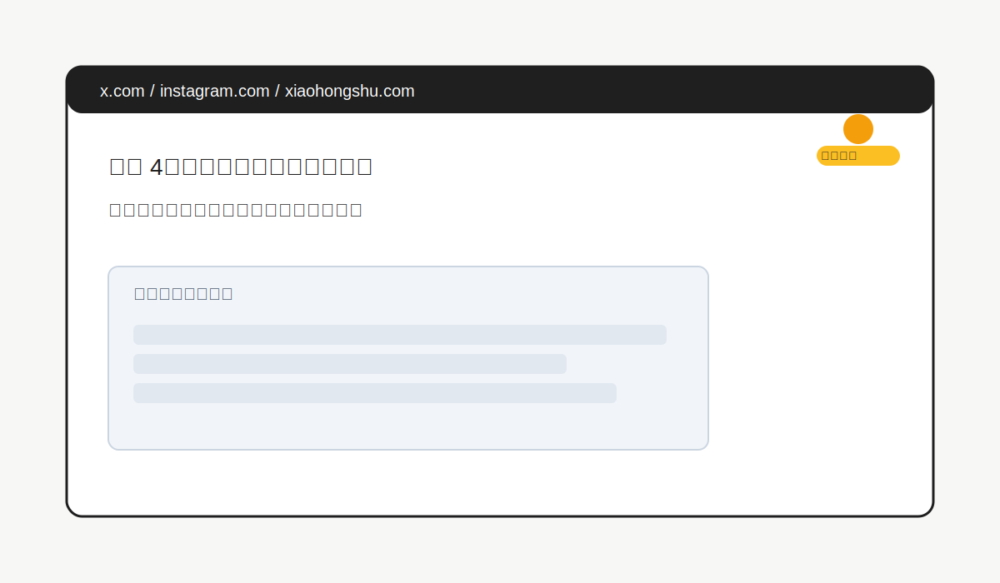
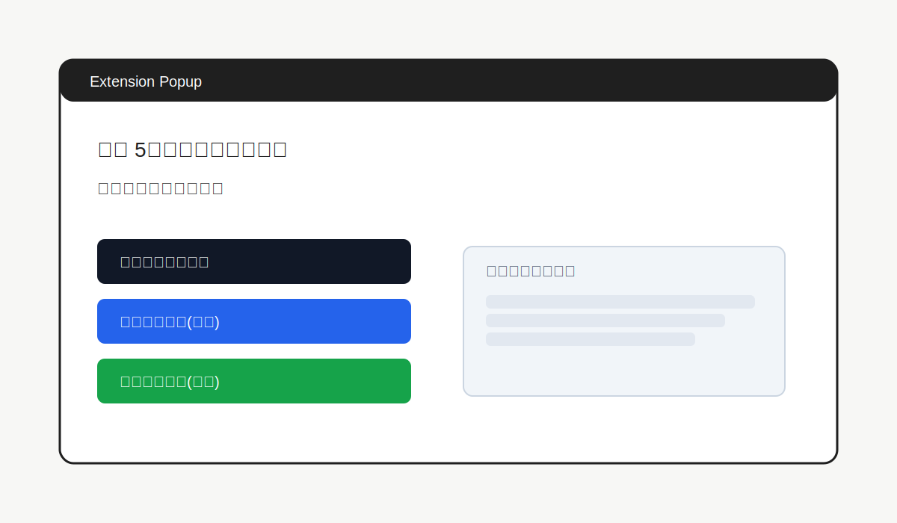

# 使用教程（图文）

本教程仅供学习使用，且仅用于你**拥有权利或明确授权**的内容下载。平台账号不提供，请自行准备并登录。
For educational use only. Use it only for content you own or have explicit permission to download. Platform accounts are not provided; please prepare and log in with your own.

## 支持平台 / Supported Sites
- 视频按钮：X/Twitter 具体帖子页、小红书 `/explore/`、带直链 MP4 `<video>` 的通用网页；不支持 Instagram 视频。  
  Video button: X/Twitter post pages, Xiaohongshu `/explore/`, and generic pages with direct MP4 `<video>` tags; Instagram video is not supported.
- 图片按钮：X/Twitter 帖子、Instagram 帖子、小红书 `explore` 帖子；列表/主页会进入分批模式。  
  Image buttons: X/Twitter posts, Instagram post pages, Xiaohongshu `explore` posts; feeds/profiles use batch mode.

## 1. 打开扩展管理页
在 Chrome 或 Edge 地址栏输入扩展页地址：  
- Chrome: `chrome://extensions/`  
- Edge: `edge://extensions/`  
Open the extensions page in Chrome or Edge:
- Chrome: `chrome://extensions/`
- Edge: `edge://extensions/`



## 2. 开启开发者模式
右上角打开 **Developer mode / 开发者模式** 开关。
Turn on **Developer mode** in the top-right corner.



## 3. 加载未打包扩展
点击 **Load unpacked / 加载已解压的扩展程序**，选择项目根目录（包含 `manifest.json` 的文件夹）。
Click **Load unpacked** and choose the project root (the folder containing `manifest.json`).



## 4. 打开目标页面并唤起扩展
打开目标帖子或页面，点击浏览器右上角扩展图标。
Open the target post/page and click the extension icon in the top-right of the browser.



## 5. 选择按钮开始下载
根据需要选择按钮 / Choose a button:
- 下载当前页面视频 / Download current page video
- 下载帖子图片(全量) / Download post images (all)
- 下载帖子图片(精确) / Download post images (precise)



## 默认配置（可选） / Default Config (Optional)
如果你修改过配置导致异常，可复制以下默认值回到对应文件顶部常量区。  
If you changed configs and things break, copy these defaults back into the top constants section of each file.

`popup.js` 顶部常量区 / `popup.js` top constants:
```js
const BATCH_SIZE = 20;
const BATCH_STATE_TTL_MS = 0;
const INS_MIN_VIDEO_BYTES = 150 * 1024;
```

`background.js` 顶部常量区 / `background.js` top constants:
```js
const IMAGE_MIN_BYTES = 10 * 1024;
const MAX_IMAGE_DOWNLOADS = 20;
const CONVERT_WEBP_TO_JPG = false;
const INS_MIN_VIDEO_BYTES = 150 * 1024;
const INSTAGRAM_NET_URL_TTL_MS = 10 * 60 * 1000;
const INSTAGRAM_NET_URL_MAX_PER_TAB = 120;
```

## 常见问题 / FAQ
- **无法下载 / Download failed**：先确认页面已完全加载；部分站点需要先播放视频再尝试。  
  Ensure the page is fully loaded; some sites require you to play the video before downloading.
- **提示未检测到资源 / No media detected**：请确认是否在具体帖子页面（而不是列表页或主页）。  
  Confirm you are on a specific post page (not a feed or profile page).
